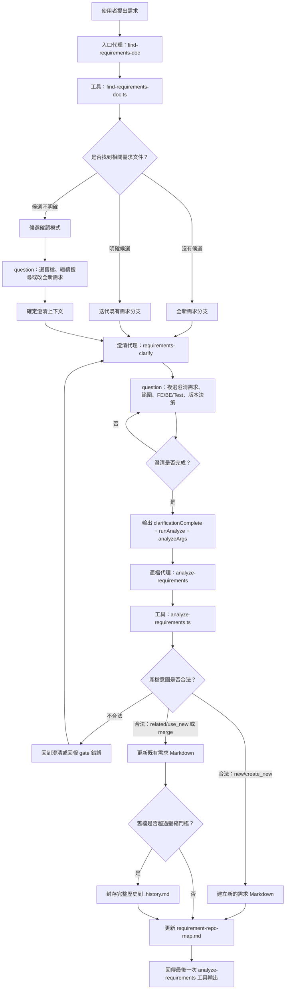
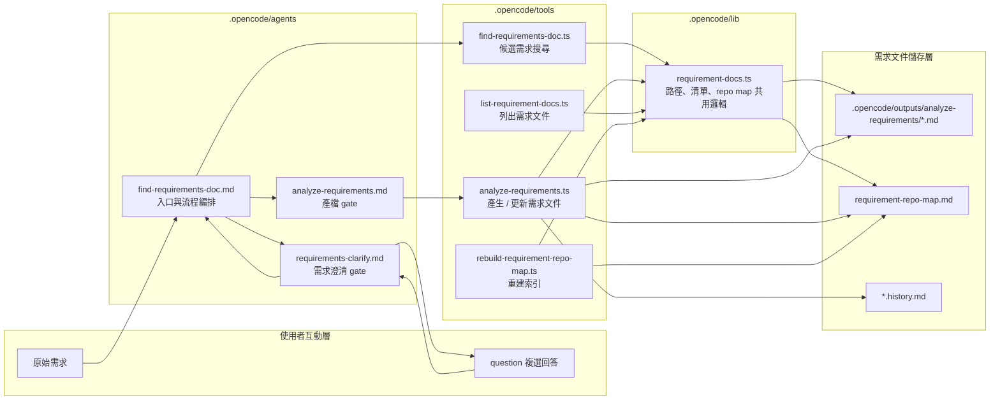

# FLOW_1：.opencode 需求分析開發流程

這份文件說明目前 `.opencode` 自訂流程。這套流程不是直接寫程式碼，而是把使用者提出的需求先整理成可落地的需求分析文件，讓後續開發、測試與專案管理可以依同一份 Markdown 需求文件工作。

## 核心目的

- 先判斷本次需求是否和既有需求文件相關。
- 不管是否找到既有文件，都必須先進行互動式需求澄清。
- 澄清完成後，一定產出或更新 `.opencode/outputs/analyze-requirements` 內的 Markdown 需求分析文件。
- 同步維護 `requirement-repo-map.md`，讓下一次需求可以更快搜尋與比對。

## 主要元件

| 類型 | 檔案 | 角色 |
| --- | --- | --- |
| 入口代理 | `.opencode/agents/find-requirements-doc.md` | 固定流程入口：先搜尋、再澄清、最後產檔 |
| 澄清代理 | `.opencode/agents/requirements-clarify.md` | 用複選題確認需求範圍、新舊需求關係與版本決策 |
| 產檔代理 | `.opencode/agents/analyze-requirements.md` | 只接受澄清後欄位，呼叫產檔工具 |
| 搜尋工具 | `.opencode/tools/find-requirements-doc.ts` | 搜尋既有需求 Markdown，判斷候選是否明確 |
| 產檔工具 | `.opencode/tools/analyze-requirements.ts` | 建立新需求文件或迭代更新舊需求文件 |
| 索引工具 | `.opencode/tools/rebuild-requirement-repo-map.ts` | 從既有 Markdown 重建 repo map |
| 共用函式 | `.opencode/lib/requirement-docs.ts` | 管理輸出目錄、文件清單、repo map 讀寫 |

## 流程圖



## 架構圖



## 關鍵規則

### 1. `requirements-clarify` 是必經 gate

搜尋結果不能直接拿來產檔。即使找到明確候選文件，也必須先呼叫 `requirements-clarify`，讓使用者透過 `question` 複選題確認需求理解、開發範圍與版本決策。

### 2. 產檔是澄清後的固定下一步

`requirements-clarify` 完成後必須輸出：

```json
{
  "clarificationComplete": true,
  "runAnalyze": true,
  "analyzeArgs": {}
}
```

入口代理收到合法 `analyzeArgs` 後，下一步只能呼叫 `analyze-requirements`，不可停在摘要、建議或版本確認文字。

### 3. 全新需求與迭代需求的決策不同

全新需求必須符合：

- `relation=new`
- `compatibility=compatible`
- `versionDecision=create_new`
- 不傳 `targetFileName`

迭代既有需求必須符合：

- `relation=related`
- `candidateFileName=<既有需求檔名>`
- `targetFileName=<同一個既有需求檔名>`
- `compatibility=compatible`
- `versionDecision=use_new` 或 `merge`
- `conflictResolution` 具體包含「保留舊需求」、「新版變更」、「不衝突原因」

### 4. 不可用未決策狀態結束流程

以下狀態只能作為澄清過程中的暫態，不可作為最終產檔輸入：

- `relation=uncertain`
- `compatibility=conflict`
- `compatibility=needs_decision`
- `versionDecision=keep_old`
- `versionDecision=needs_decision`

遇到這些狀態時，必須回到 `requirements-clarify` 或確認模式，繼續用 `question` 取得可產檔決策。

## 輸出結果

成功產檔後會產生或更新：

- 需求 Markdown：`.opencode/outputs/analyze-requirements/analyze-requirements_<uuid>_<timestamp>.md`
- 索引文件：`.opencode/outputs/analyze-requirements/requirement-repo-map.md`
- 歷史封存：舊需求檔過長時，完整歷史會封存到同目錄的 `*.history.md`

## 流程摘要

```text
使用者需求
  -> 搜尋既有需求文件
  -> 判斷全新 / 明確候選 / 候選不明確
  -> 必經複選澄清
  -> 輸出結構化 analyzeArgs
  -> gate 檢查新舊需求與版本決策
  -> 建新檔或更新舊檔
  -> 更新 requirement-repo-map.md
```
