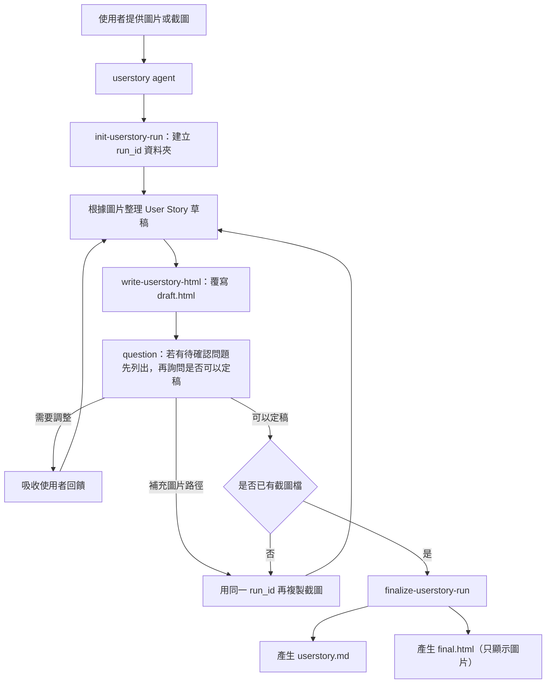

# FLOW_1：.opencode 圖片產生 User Story 流程

這份文件說明目前 `.opencode` 自訂流程。此版本只處理「根據使用者提供的圖片或截圖產生 User Story」，並透過 HTML 草稿讓使用者反覆確認，直到使用者接受後才輸出最終 Markdown 與圖片 HTML。

## 核心目的

- 啟動流程時建立獨立 `run_id` 資料夾。
- 根據使用者提供的圖片/截圖整理 User Story。
- 每次調整都覆寫同一份 `draft.html`，方便閱讀與確認。
- 使用者明確接受後，產生 `userstory.md` 與 `final.html`。
- `final.html` 只顯示使用者提供的截圖。

## 主要元件

| 類型 | 檔案 | 角色 |
| --- | --- | --- |
| 預設設定 | `.opencode/opencode.json` | 將 `userstory` 設為預設 agent |
| 入口代理 | `.opencode/agents/userstory.md` | 固定流程入口：看圖、產 User Story、更新 HTML、詢問確認、定稿 |
| 初始化工具 | `.opencode/tools/init-userstory-run.ts` | 建立 `run_id` 資料夾並複製本機圖片到 `screenshots/` |
| 草稿工具 | `.opencode/tools/write-userstory-html.ts` | 產生或覆寫 `draft.html`，內含 User Story 結構化資料 |
| 定稿工具 | `.opencode/tools/finalize-userstory-run.ts` | 依 `draft.html` 產生 `userstory.md` 與只顯示圖片的 `final.html` |
| 共用函式 | `.opencode/lib/userstory-runs.ts` | 管理輸出路徑、run_id、截圖清單與 HTML/Markdown 共用邏輯 |

## 輸出結構

```text
.opencode/outputs/userstory/
  <run_id>/
    screenshots/
      image-001.png
      image-002.png
    draft.html
    userstory.md
    final.html
```

## 流程圖



## 關鍵規則

### 1. `run_id` 是必經起點

每次新流程都必須先呼叫 `init-userstory-run`。工具會建立：

- `.opencode/outputs/userstory/<run_id>/`
- `.opencode/outputs/userstory/<run_id>/screenshots/`

若使用者有提供本機圖片路徑，工具會複製到 `screenshots/`，並命名為 `image-001.png`、`image-002.png` 等。

### 2. HTML 是動態草稿

`draft.html` 是目前 User Story 的閱讀版草稿。每次使用者要求修改，都覆寫同一份 `draft.html`，不建立多份版本檔。

### 3. 使用者接受前不可定稿

每次更新草稿後，agent 必須詢問使用者是否可以定稿。若草稿有「待確認問題」，`question` 必須先把問題逐條顯示出來，讓使用者可補充或確認。只有使用者明確表示接受，才能呼叫 `finalize-userstory-run`。

### 4. 最終輸出必須包含截圖

`finalize-userstory-run` 會檢查 `screenshots/`。若沒有已複製的截圖，工具會拒絕產檔，要求先補充本機圖片路徑。

### 5. 只產 User Story，不產技術方案

流程只整理使用者角色、情境、User Story、驗收條件、假設與待確認問題。不得展開 API、資料庫、架構、部署、測試框架或程式實作。

## 使用摘要

```text
使用者圖片/截圖
  -> 建立 run_id 資料夾
  -> 複製截圖到 screenshots/
  -> 產生 draft.html
  -> 詢問使用者是否可以
  -> 若不可以，反覆更新 draft.html
  -> 使用者接受
  -> 產生 userstory.md
  -> 產生 final.html（只顯示圖片）
```
