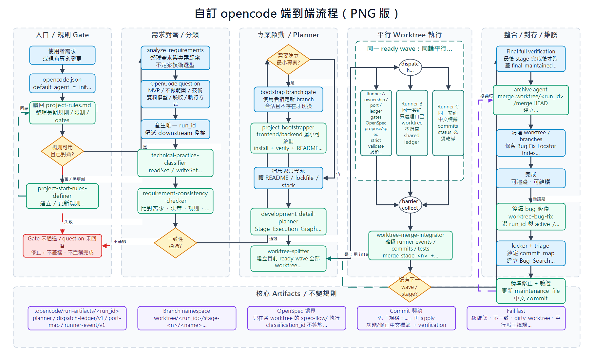

# 自訂 OpenCode 工作流程說明

這份文件說明目前專案內 `.opencode` 自訂流程的端到端運作方式，並附上 diagrams.net 流程圖原檔，方便後續維護、溝通與調整。

## 流程定位

本流程的入口由 `opencode.json` 指向 `init-project` agent。它不是單一線性腳本，而是一套帶有 gate、分類、平行 worktree、整合驗證與封存維護的開發流程。

核心目標是讓每次需求落地前都先完成規則讀回、需求確認、技術分類與一致性檢查，避免在需求不完整、規則未對齊或分類互相衝突時直接產檔或實作。

## 主要階段

1. 入口與規則讀回
   - 從使用者需求或現有專案變更開始。
   - 由 `init-project` 讀取 `.opencode/project-rules.md`。
   - 若規則缺失或需要更新，交給 `project-start-rules-definer` 處理。
   - 任一 gate 未通過或必要確認未完成時，流程必須停止。

2. 需求對齊與分類
   - `analyze_requirements` 只負責整理線索，不直接定案技術選型。
   - 必須透過 OpenCode `question` 確認 MVP、不做範圍、技術、資料模型、驗收與執行方式。
   - 產生唯一 `run_id`，供後續 artifacts、worktree、ledger 與 commit body 追蹤。
   - `technical-practice-classifier` 依 `readSet`、`writeSet`、Dependency Graph 與 Conflict Graph 切分互斥且低影響的工作分類。
   - `requirement-consistency-checker` 檢查需求、決策、規則與分類是否一致。

3. 專案啟動與 planner
   - 若需要建立最小專案，必須先通過 bootstrap branch gate；可建立新 branch，也可在安全檢查後續用既有 bootstrap branch。
   - `project-bootstrapper` 建立或啟動 frontend/backend 最小可運作專案，完成 install、verify、README 與中文 bootstrap commit。
   - 若沿用既有專案，則讀取 README、lockfile 與既有 stack。
   - `development-detail-planner` 產出 Stage Execution Graph、ready wave、port 分配與 dispatch ledger 設計。

4. 平行 worktree 執行
   - `worktree-splitter` 只建立目前 ready wave 的全部 worktree，不實作、不測試、不 commit。
   - 同一 ready wave 必須同輪平行 dispatch。
   - 每個 runner 只處理自己的 ownership、port 與 worktree。
   - runner 依序完成 OpenSpec propose/spec、strict validate、規格 commit、apply/fallback、local verification 與中文標籤 commits。
   - runner 只產生自己的 `runner-event/v1` artifact，不直接寫 shared ledger。

5. Barrier、整合與封存
   - `barrier collect` 確認所有 runner event、HEAD、spec commit、local verification 與 ledger 對齊。
   - `worktree-merge-integrator` 在 merge worktree 中整合 ready wave，並執行階段整合測試。
   - 若還有下一個 wave 或 stage，以下一個 integration head 作為基準重建下一批 worktree。
   - 最後 stage 完成後才執行 final full verification。
   - `archive` agent 將 `.worktree/<run_id>/merge` 的最終 `HEAD` 合併回 bootstrap branch，並驗證 final tracked `spec-flow/**` 也隨 merge-back 保留到 bootstrap branch，再建立可供 bug fix 定位的 archive 檔。

6. 後續 bug 維護
   - `worktree-bug-fix` 以 `run_id` 選定 active 或 archived 模式。
   - `worktree-run-id-change-locker` 鎖定 merge worktree 與 commit map。
   - `worktree-bug-triage` 建立 Bug Search Packet。
   - 修正必須精準落在目標範圍，完成驗證後更新 maintenance file 並建立中文 commit。

## 關鍵約束

- execution branch namespace 固定為 `worktree/<run_id>/stage-<n>/<name>`。
- OpenSpec 只能在各 stage worktree 的 `spec-flow/` 內執行。
- `classification_id` 與 `openspec_change` 必須分離。
- shared dispatch ledger 只能由主流程、splitter 或 merge/barrier integrator 寫入。
- runner 不得直接寫 shared ledger。
- 缺確認、不一致、dirty worktree、平行派工違規或 schema 不符時必須 fail fast。
- `規格：...` commit 必須先於 apply/fallback commit。
- runtime artifacts、cache、local secrets、log、tmp 與 local DB 不得納入產品 commit。

## 流程圖

下方為 PNG 預覽圖：

流程圖原檔也已附在同一分支，方便後續用 diagrams.net 編輯：

[opencode-workflow.drawio](./opencode-workflow.drawio)

若在 GitHub 頁面無法直接預覽 `.drawio`，可下載該檔案後用 diagrams.net 開啟。
